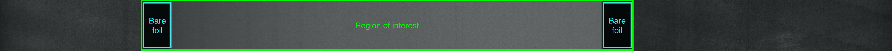

# ml-labeling
Instructions and example images for labeling of data.

# Description

Images of material on a roller. During manufacturing, certain type of anomalies and defects can arise. We want to detect and find the locations of these defects. The material should be smooth without any apparent anomalies. Note: most images will not contain any defects at all.

# Region of interest

The images show material on a roller. The outmost parts (left and right) are the roller. We are only interested in the material and the bare foil, see image:

Any defect or anomalies outside of this region are irrelevant and should not be labeled.

# Good examples

There are 3 categories of bounding boxes: anomaly, knurling and anomaly-edge:

1. anomaly: any dent, hole or scratch in the region of interest, but not on the bare foil:

2. knurling: a special type of anomaly where a series of bumps appear close to the edge of the material:

3. anomaly-edge: anomalies that occur in the bare foil of the photos

# Bad examples

We do not care about defects that are not in the region of interest, for example:

