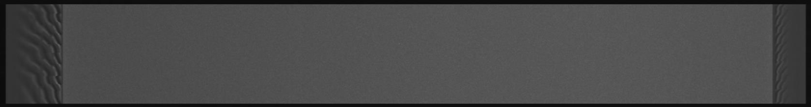
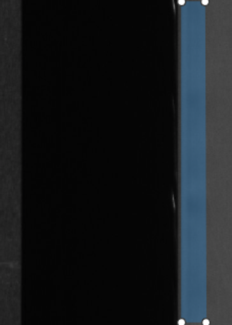
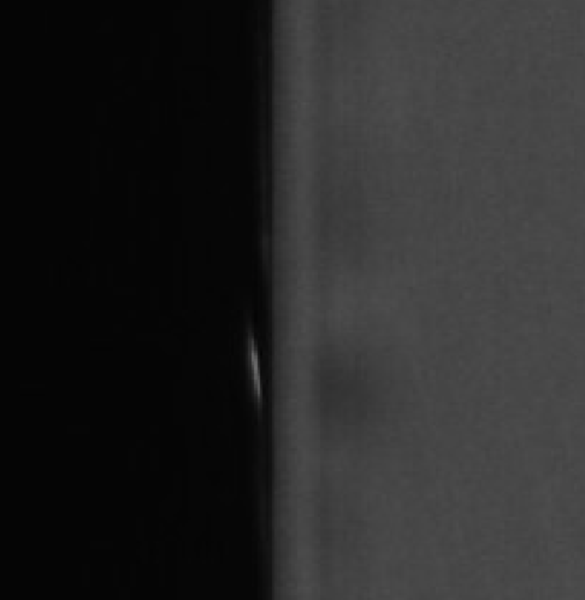
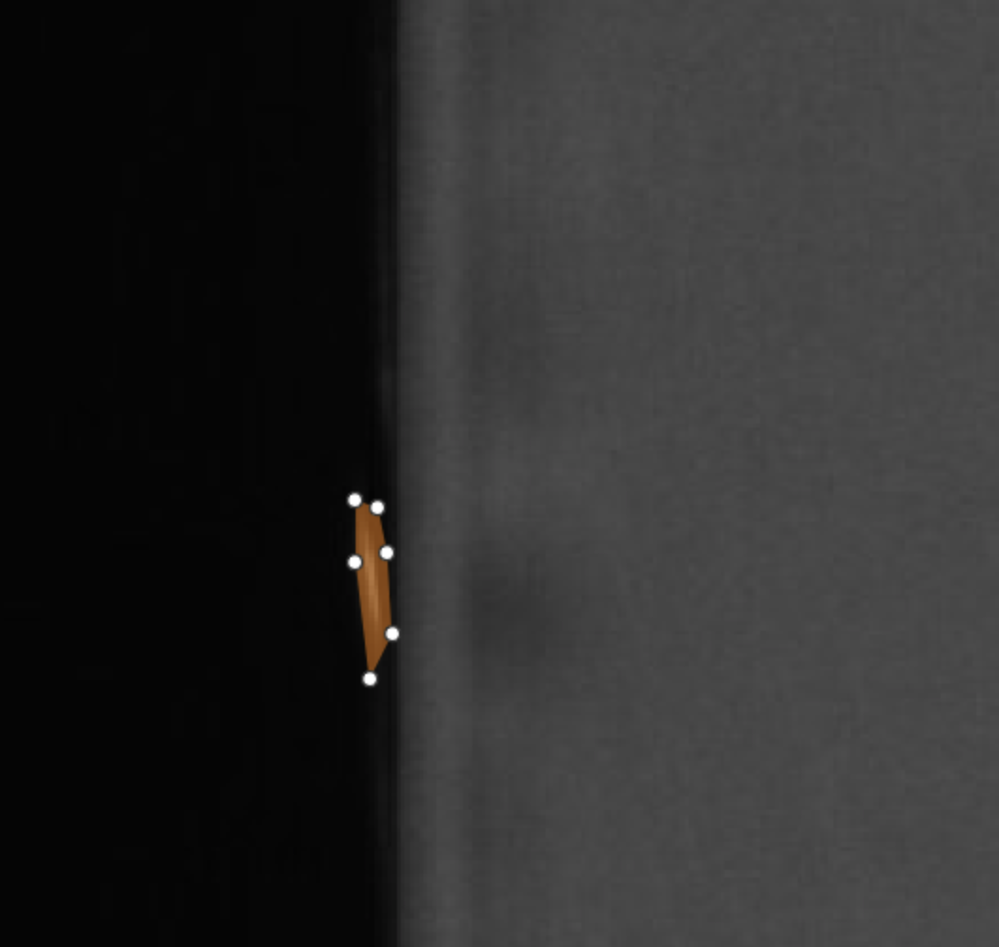
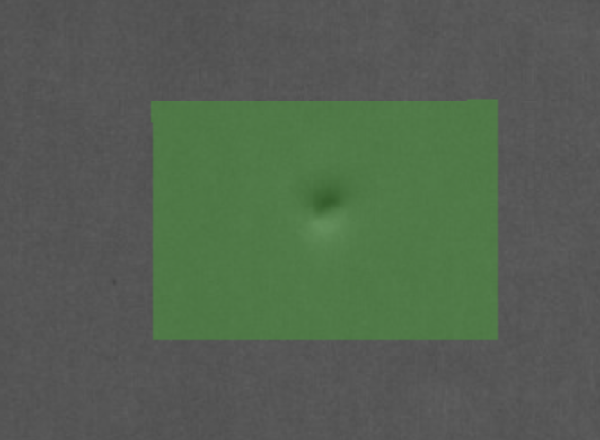

# Presser
Instructions and example images for annotation of presser image data.

# Description

Images of material on a roller. During manufacturing, certain type of anomalies and defects can arise. We want to detect and find the locations of these defects. The material should be smooth without any apparent anomalies, but there might be vertical lines which is normally ok.
Note: some images may not contain any defects at all and should be left without any annotation.

# General instructions

You do not have a lot of time to label, so please only focus on the most obvious defects. If you are unsure, skip it or leave the defect unlabeled.

## Region of interest

The images show material on a roller. The outmost parts (left and right) are the roller. We are only interested in the material and the bare foil. Where the region of interest is will vary slightly in each image:

Any defect or anomalies outside of this region are irrelevant and should not be labeled.

# Types of defects

There are 3 categories of defects: anomaly, knurling and foil-anomaly.

1. anomaly: any fairly obvious dent, hole or scratch in the region of interest, but not on the bare foil:

2. knurling: a special type of anomaly where a series of bumps or wrinkles appear close to the edge of the material:

3. foil-anomaly: anomalies that occur in the bare foil of the photos

Moreover, the images could show different material with certain characteristics. For example, the wrinkles in the bare foil as shown in the image below should not be treated as a foil-anomaly. The focus with respect to foil-anomalies should be on more local anomalies as visualized in the foil-anomaly example above. 

### Good examples
Don't spend too much time annotating everything perfect, however try to label as few non-defect pixels as possible:

#### Anomaly 

 

#### Knurling 
 

#### Foil anomaly
 

### Bad examples

Area around annotated defect is too large:

We do not care about defects that are not in the region of interest, for example:

### Labeling example 
Image pre labeling: 

Image after labeling, where green refers to an anomaly, blue refers to knurling and orange refers to foil-anomalies:

