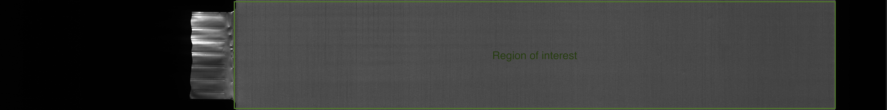
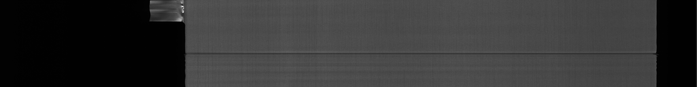
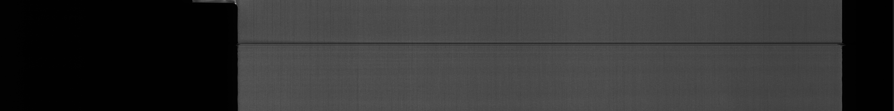
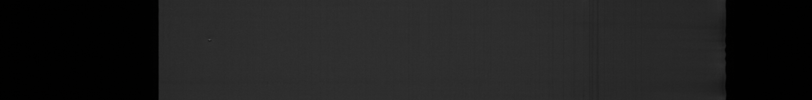
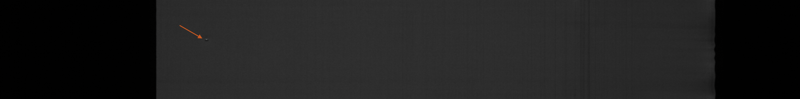
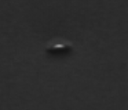
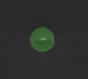

# Stacker
Instructions and example images for annotation of stacker image data.

# Description

The task is to annotate defects on the electrodes during stacking in cell assembly. The defects are annotated by the use of an external tool available as a service on Amazon Web Services. The maximum time to spend annotating one image is set to five minutes, if a task is completed before time exceeds simply press _submit_ in the bottom left corner and proceed.

__N.B.__ if there are no defects present in an image, select _Nothing to label_ in the bottom left corner followed by _submit_ in order to move on to the next image. In case of uncertainty, press _Decline task_ to move on to the next image.

## Region of interest

The region of interest regarding this task is the coated area as presented in the Figure below. Hence, in the case of a tab being present, this should not be annotated.

Any defect or anomalies outside of this region are irrelevant and should not be labeled.

## Camera artefacts

Due to the nature of the stacker machine i.e., that it runs in a non-continous manner with lots of stops, some images suffer from camera specific artefacts which should not be annotated as defects. Below are two examples of aforementioned artefact:

### Annotation example
Don't spend too much time annotating everything perfect, however try to label as few non-defect pixels as possible.

Given an image to annotate:

The defect is located:

The image is zoomed and the defect is then annotated:

 